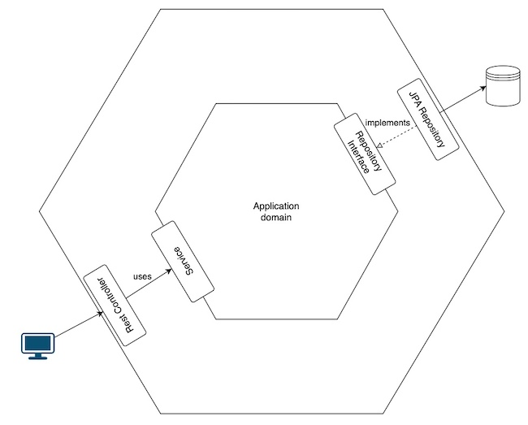

# Technical exam
## Introduction

This is a technical exam for a job application. The goal is to create a Spring boot application with a single REST service to retrieve the price for a given product, in a given store, and in the given date/time.


## Overall design

The app was developed using SpringBoot version 3.2.3, Java 17, and Maven as a build tool. The database is H2, as requested. It follows the hexagonal architecture, sometimes also called the ports and adapters architecture. This may seem too much for such a simple app, but this is the whole point of this exercise, to show technical and architectural knowledge, even if it is not necessary for this specific case.



## How to run
### Application

To run the application, use:

```shell
./mvnw spring-boot:run -Dspring-boot.run.profiles=local
```

Then, to access the REST service, use:

```shell
curl -X GET "http://localhost:8080/api/v1/product-price?brandId=1&productId=35455&date=2020-07-01T01:00:00" -H "accept: application/json"
```

Swagger is at http://localhost:8080/swagger-ui.html

### Tests

To run the tests, use:

```shell
./mvnw test
```

## Decisions

During the development, I had to make some decisions, as explained below.

### Database

The database used was a simple in memory H2, as requested for the exam. I personally would have preferred to use a real database, within a docker container, to make it a more realistic scenario. In a real world scenario, using a real database can be a better choice to detect possible problems earlier.  
This can be done without much effort, loading the correct drivers, changing the parameters in application.yaml, and sniping up the database with the help of a docker-compose.yml file.  
But despite the H2 database, I used Flyway to manage the database schema, mostly to show how to use it, and to make it easier to change the database in the future.  
Another thing I like is to use TestContainers for the tests, also to make it closer to a real world scenario, but that was not the case here, since we are using H2.  
But I was able to leverage some Spring features for database testing, like `@DataJpaTest`, to show how the framework can help in some situations. In this case only classes related to JPA will be autoconfigured and added to the context, making the test lighter to execute.

#### Database access

I Used JpaRepository and chose Spring's JPA query model to show knowledge of the framework. This allowed me to create the query I needed for the REST service without having to write the full method and query, not even the class, it is all in an interface:

```java
    ProductPrice findFirstByBrandIdAndProductIdAndStartDateLessThanEqualAndEndDateGreaterThanEqualOrderByPriorityDesc(
      Long brandId, Long productId, LocalDateTime startDate, LocalDateTime endDate);
```

But in a day-to-day use, I personally prefer the JdbcTemplate, to have more control over the queries, and to avoid some problems with the JPA model, like the undesired/not needed joins and additional queries at runtime. But for this simple case, the JPA model is enough.

### REST API

I used the Spring OpenApi annotations to document the only REST service, this can be seen at http://localhost:8080/swagger-ui.html. I used some interesting annotations, like `@Schema`, `@ApiResponses` and `@Content`, to describe the response codes, types and the parameters, with examples, to show how to use them.

### Domain model, DTOs and mappers

The exercise is very simple, but to demonstrate the correct use of the hexagonal architecture, I created separate classes for the database model, the domain model and the REST response model. I wouldn't say this is really necessary for this simple case, but it is a good practice for a more complex application.  
I made the database model have 2 tables, just to emphasize the aforementioned, showing that database model, internal model and REST model are different things, and, of course, doesn't need to be the same.  
The mappers (using mapstruct in this case) can help, but can also lead to some problems in big applications, like having null values, specially when renaming/adding/removing the related classes' properties. Since they infer the source/destination mappings, they won't necessarily fail when changing the classes, and this can lead to some unexpected problems.  
To help mitigating this issue, I usually add unit tests for the mappings, to make sure they are working as expected. This is what I did for the 2 mappers in this project.

### Logging

I find logs very important, so almost every class in this project has a logger, being it just informative or an error one.

### Tests
#### Unit tests

Unit tests were written with JUnit 5 and Mockito, and AssertJ for the assertions. I also used the `@DataJpaTest` annotation to test the database layer. There is a specific test-data.sql file to populate the database for the tests that need it.

#### Integration tests

I used the `@SpringBootTest` and `@AutoConfigureMockMvc` annotations to test the REST service with the database. The related class is ProductPriceIntegrationTest.java.  
All the 5 required test cases are covered in this test, along with not found and bad request cases.

#### Karate tests

I wanted to show how to do a proper API test, so I used Karate to do it. It can be found at src/test/java/karate/product/getProductPrice.feature.  
Again, I added all 5 required test cases, along with not found and bad request cases.

## Improvements
There is always room for improvement, and for a real world application, I would suggest:
- **Reactive programming**: well, this one is kind of tricky, Spring WebFlux is supposed to make the application more scalable and responsive, I used it before, but I think it adds too much complexity to the app, so this needs to be well discussed by the team.
- **Sonarqube**: always recommended in the CI/CD pipeline.
- **Snyk**: also always recommended to have some tool checking for vulnerable dependencies.
- **Renovate bot**: good tool to help keeping the dependencies up to date in an automated way.
- **Fitness functions**: I like using fitness functions to ensure no developer is breaking the architecture, like the hexagonal one. We can create tests to check if people are skipping layers, or adding dependencies that are not allowed. Specially useful when there are juniors in the project.
- **Mutation testing**: Can be useful, specially when there are too many juniors in the project, but on the other hand it can take too long to execute (depending on the configuration, of course). Executing it only in the CI/CD pipeline (and not in local) can be an option.
- **Docker in local development**: as I said before, when we have to interact with databases, messaging systems, and other kinds of integrations, having docker containers and using TestContainers can make the development and testing easier closer to what is expected in production.

## Conclusion

This was an interesting exercise. Of course there are other ways of doing almost everything I did here. But I tried to show some good practices and some ways of leveraging the Spring framework.  
Like I said before, in the real world, with real requirements, like performance, sometimes we need to make different decisions.
